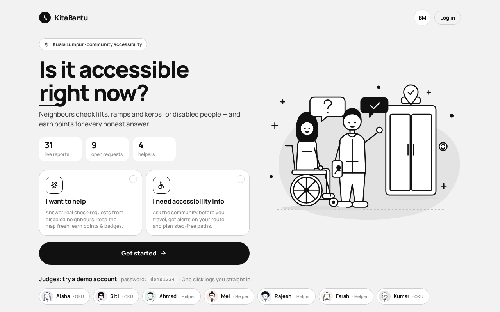
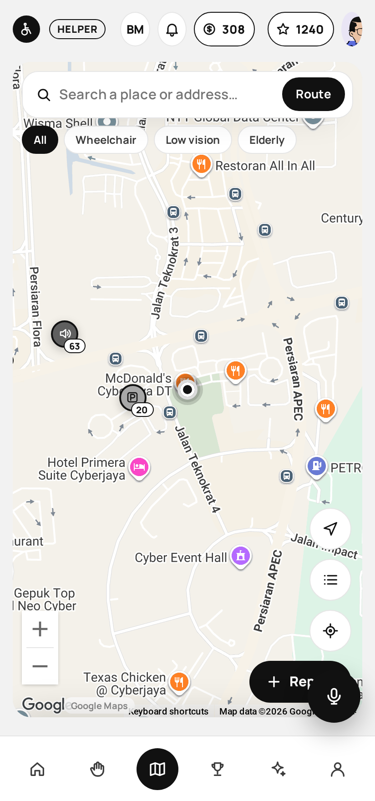
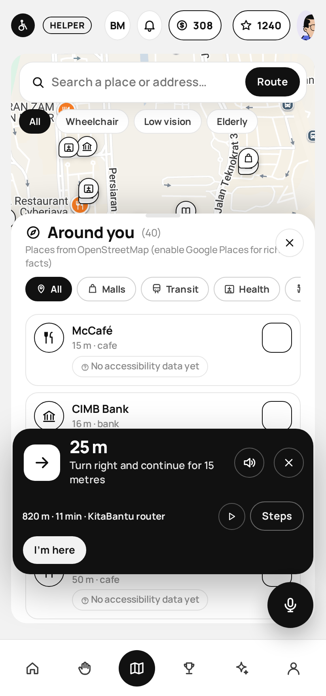
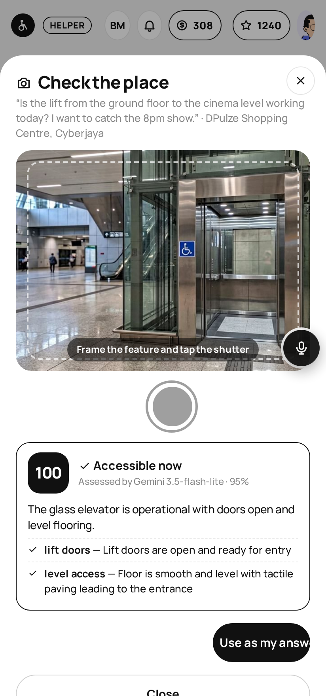
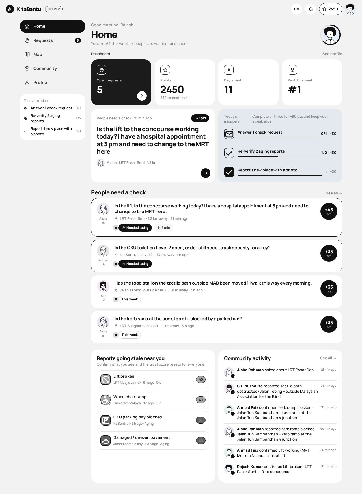
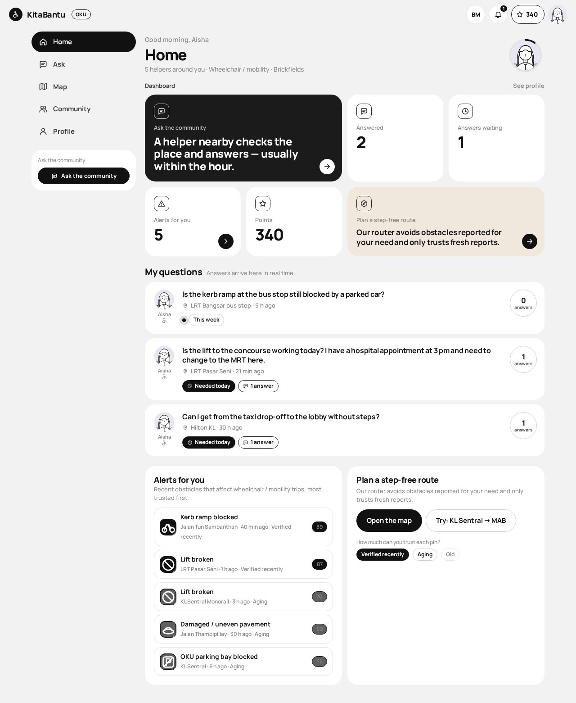

# KitaBantu — "Is it accessible *right now*?"

**Hackathon Sedia! · SDG 11 (Sustainable Cities & Communities) · target 11.7**

A calm, two-sided community app for OKU accessibility in Malaysia (pilot areas:
**Cyberjaya** and central KL) — monochrome line-art UI on top of a **real Google Map**,
bento dashboards, a line-art **avatar builder**, and a **voice AI guide** (Gemini) that
takes you to a task, describes the route step by step, and **assesses the photo you
take when you arrive**:

- **OKU members** (wheelchair / low-vision / elderly) *ask the community* before they
  travel — "Is the lift at Pasar Seni working today?" — pinned to a place, with urgency.
  They get real-time answers, obstacle alerts for their need, and a step-free router.
- **Helpers** (everyone else) get a game: a live board of **real check-requests with
  point bounties**, daily missions, streaks, levels, 12 badges, a leaderboard, and a
  confetti reward every time they help someone.

Every answer and report also feeds a **trust-decaying accessibility map** and a
**need-aware router** (the Map tab). No fake matching, no scraping, no e-hailing.

**New in v4 — the guide layer**

| | |
|---|---|
| **Real map** | Google Maps JavaScript API (full real-world detail around your GPS position) with trust pins, *Around you* places (Google Places → OpenStreetMap fallback), need filter. Set `localStorage kb.mapEngine='osm'` to force the Leaflet fallback. |
| **Voice assistant** | Mic button (bottom-right): browser Web Speech (EN-MY / MS-MY, auto-detect) → Gemini with live context (your location, nearby reports & open requests, current navigation) → speaks back and acts: *navigate*, *find places*, *open request*, *next step / repeat*, *open camera*. |
| **Turn-by-turn** | *Take me there* on any request or place → `/api/navigate` (need-aware local router; Google Routes when enabled) → black banner with distance + next manoeuvre, spoken at <60 m, re-route when >45 m off the line, *Steps* sheet with *Read all*, arrival card. On a laptop without GPS a *Simulate walk* button moves you along the route. |
| **Camera → AI** | *I'm here* → in-app camera (rear/front, or gallery) → `/api/assess`: Gemini vision returns verdict, 0-100 score, findings, hazards and a suggested report type, in the UI language → one tap pre-fills the answer (helper) or a new report; the AI badge is stored with the answer. |
| **Permissions** | First login asks for **location, camera, microphone, notifications and motion/compass** (plus a screen wake-lock and persistent storage, which need no prompt) with a friendly explainer; state is shown in *Profile → Settings → Permissions* (re-askable, or just say *"open permissions"*). |

**New in v5 — the agent (the assistant now runs the whole app)**

| | |
|---|---|
| **Full app control by voice** | `POST /api/agent` runs Gemini **native function calling** in a loop (≤6 rounds) with **29 tools**. *Server tools* execute immediately with the signed-in user's authority: `search_places`, `geocode`, `list_reports`, `list_requests`, `get_request`, `answer_request`, `create_request`, `thank_answer`, `create_report`, `verify_report`, `plan_route`, `get_profile`, `update_profile`, `get_leaderboard`, `get_feed`, `get_stats`, `demo_control`. *Client tools* come back as `actions[]` and are executed by `guide.js`: `start_navigation`, `stop_navigation`, `navigation_step`, `show_places_on_map`, `focus_map`, `map_zoom`, `open_screen`, `open_camera`, `prefill_ask`, `set_language`, `set_setting` (mute / large text / permissions), `logout`. Short per-user memory makes follow-ups work ("open the second one", "yes, take me there"). |
| **Whole-map search** | The agent searches the entire map, not a fixed list: free text + category + radius over the offline POI snapshot (4,348 places, instant) → Google Places (New) → Nominatim. Understands EN/BM category words ("farmasi terdekat", "tandas OKU", "surau", "stesen ERL") and names ("Gem In Mall", "Hospital Cyberjaya", "Maybank"); results are always shown on the map (pins + list, or a pulsing highlight pin) and can be routed to in the same breath. |
| **Never blocked by quota** | Simple commands (screens, settings, language, stop/repeat, camera, zoom, logout) are resolved **locally in <5 ms** without the LLM. If Gemini is rate-limited (free tier) or slow (16 s budget), a rule-based fallback still searches, navigates, opens requests, answers a request or posts a community question — the demo keeps working. |

Try saying: *"cari farmasi paling dekat dan bawa saya ke sana"* · *"what tasks are near me?"* · *"open the first one"* · *"answer Kumar's toilet request: yes, it's open and clean"* · *"tanya komuniti sama ada tandas OKU di Gem In Mall dibuka hari ini"* · *"show the leaderboard"* · *"tukar ke bahasa melayu dan senyapkan suara"* · *"turn on large text"* · *"I have arrived"* (opens the camera) · *"how many points do I have?"* · *"is the way to DPulze step-free?"*

> Problem statement: *OKU individuals lack a reliable way to know whether their
> intended destinations and transit routes are accessible **right now**, because
> existing information is scattered, static, or outdated.*



| Real Google map around you | Voice assistant + turn-by-turn | Camera → Gemini assessment |
|---|---|---|
|  |  |  |

| Helper dashboard (cool grey tint) | OKU dashboard (warm sand tint) |
|---|---|
|  |  |

## Run it

```bash
npm install
npm start            # http://localhost:3000
npm test             # 32 unit tests: trust engine, local router, routing, store/auth/requests
npm run e2e          # Playwright browser flow → docs/shots/ (needs: pip install playwright)
python3 docs/nav-test.py   # v4 browser flow: permissions → map → places → assistant → navigation → camera → AI → answer
```

Keys go in `.env` (never committed):

```
GOOGLE_MAPS_API_KEY=...   # Maps JavaScript API is enough for the map; also enable
                          # Places API (New), Routes API and Geocoding API on the same
                          # Cloud project for Google places / routes / addresses —
                          # otherwise the app falls back to OpenStreetMap (Overpass,
                          # Nominatim) and the built-in need-aware router automatically.
GEMINI_API_KEY=...        # voice assistant + camera assessment (free tier is fine: the
                          # server hedges across gemini-3.6-flash / 3.5-flash / 3.5-flash-lite
                          # / 3.1-flash-lite and cools down models that return 429/503)
```

**Demo accounts** (password `demo1234`, one-click buttons on the landing page):

| Email | Role | Notes |
|---|---|---|
| raj@demo.my | Helper | Lv 5 Community Hero, 2 450 pts, 11-day streak, #1 this week |
| ahmad@demo.my · mei@demo.my · farah@demo.my | Helpers | Lv 4 / Lv 4 / Lv 3 |
| aisha@demo.my | OKU · wheelchair | has 1 open + 1 answered + 1 closed question |
| siti@demo.my | OKU · low vision | |
| kumar@demo.my | OKU · elderly | |

Or **sign up** as a new helper / OKU member (3 steps: role → details → build your avatar:
Head / Body / Item / Glasses / Mobility tabs + palette, shuffle, live preview).
You can re-open the builder any time from *Profile → Edit avatar*.
Sessions use scrypt-hashed passwords and bearer tokens (`lib/auth.js`); the in-memory
store keeps you logged in across a demo reset.

Without `GEMINI_API_KEY` the assistant and camera assessment are hidden and a
zero-dependency basic photo check still runs; without `GOOGLE_MAPS_API_KEY` the map
uses OpenStreetMap tiles. Everything else works offline from the in-memory seed.

## Two dashboards, one loop

```
OKU member                          Helper
──────────                          ──────
Ask (place + question + urgency) ─► Requests board (bounty +25, +10 fast ≤30 min, +10 photo)
                                     │  Answer: Yes / Partly / No + note + photo (+ GPS on-site tag)
◄── real-time answer (SSE + 🔔) ─────┘
Say thank you (+5 to helper, closes request)
Alerts: fresh obstacles for MY need   Missions: answer 1 · re-verify 2 · report 1 (+30 each)
Step-free route (Map tab)            Streak flame (+5/day, cap 25) · levels · 12 badges · leaderboard
```

Everything a helper does pays out through one function (`Store.award`), which also
applies the streak bonus, unlocks badges, auto-claims missions and fires a level-up —
the reward modal then shows the itemised breakdown with confetti (`public/js/fx.js`).

## What was cut from the original plan — and why that's a feature

| Cut | Why |
|---|---|
| Be My Eyes-style live help matching | Solves a different problem (live human assistance), not information verification. It is a second app. |
| Social-media scraping | Platforms paywall/forbid it; ToS risk; not buildable cleanly in 24 h. |
| Grab/Maxim e-hailing coverage | Needs partner API access we don't have. |

## The trust engine (the part to talk about)

`lib/trust.js` — pure functions, unit-tested.

1. **Evidence ceiling.** A report's *starting* trust depends on evidence, not just
   on who posted it: bare report 70 · +15 photo · +7.5 per on-site confirmation
   (+3.75 remote, capped +15) · −15 if the AI photo check flags a mismatch · −35 per
   dispute. Two disputes remove it. You cannot make a text-only rumour look like a
   photographed, twice-confirmed fact.
2. **Volatility-aware decay.** Real-world truths change at different speeds, so the
   decay clock runs at different rates per report type (`lib/catalogue.js`):
   - `high` (lift broken, kerb blocked, construction): 50 % after ~10 h, expired ≈ 1.6 days
   - `medium` (lift working, staff, parking): 50 % after ~2.5 days, expired ≈ 10 days
   - `low` (ramp, tactile paving, steps-only entrance): 50 % after ~12 days, expired ≈ 45 days
3. **Confirm resets the clock; dispute collapses the score.** Confirming within 75 m
   (GPS) counts fully and earns a bonus; remote confirmations count half.
4. **Four trust bands** (greyscale, always paired with the number and a label) shown on
   every pin, in the list, in routing and on the council dashboard:
   ● 80–100 verified · ● 50–79 aging · ● 20–49 old · ○ 0–19 expired.
   Each report also tells you *when* it will drop to the next band.

## Need-aware routing (our own router)

`lib/localrouter.js` + `lib/routing.js`

Inside the pilot area (central KL, ~24 000 nodes / 31 000 edges of OpenStreetMap
footways, roads, stairs and corridors — built by `scripts/build-graph.js` from an
Overpass extract) we run our **own A\* router**, because generic walking routers
happily send a wheelchair down a staircase:

1. **Need-aware edge costs.** For wheelchair users `steps` and `wheelchair=no`
   ways are impassable; roads with no mapped sidewalk cost ×1.6; dedicated
   footways are preferred. Elderly / low-vision profiles have their own weights
   (e.g. sharing a lane with traffic is the main hazard for low vision).
2. **Obstacle-aware costs.** Active KitaBantu obstacle reports relevant to the
   need add `severity × trust × 8 m` of virtual length to the edges they sit on
   *before* the search, so detours **emerge from the search** — no via-point
   guessing.
3. **Community data unlocks the map.** OSM rarely maps station lifts as routable
   ways. A trusted (≥ 40/100) *"lift working"* report within 80 m makes nearby
   stairs passable for wheelchair/elderly users; a *"lift broken"* report vetoes
   it. Because trust decays, an un-reconfirmed lift stops unlocking — and the UI
   then shows *"a 770 m route exists, but its lift report has gone stale — re-confirm it"*.
4. **Three candidates**: the aware route (recommended), the obstacle-blind
   shortest route (so users see what they'd walk into), and a diverse alternative
   that avoids the recommended route's middle third.
5. Every candidate is then scored (`100 − Σ severity × trust`, blended with the
   worst hit) and gets a **coverage** figure — the share of the path with *any*
   recent report nearby. No reports ≠ accessible; it means *unknown*, and the
   verdict says so.

Outside the pilot bbox we fall back to OSRM's generic foot profile (public server,
with a backup host) and label it clearly; if that fails, a straight-line estimate.

Demo route: KL Sentral → Malaysian Association for the Blind (wheelchair).
Shortest 770 m scores **57** (blocked kerb, trust 89). Recommended 811 m scores
**100**, and it only gets onto the Nu Sentral walkway because Mei reported the
KL Sentral lift working 2 h ago. Switch to *Low vision*: the kerb is irrelevant,
the 770 m route scores 100 and lists the tactile path and audible crossing.
Press *+3 days*: the lift report has decayed to 9 → stairs lock again → the
wheelchair route becomes a 1 596 m street detour, with a hint naming the exact
report to re-confirm.

## Architecture

```
public/index.html, app.css   monochrome design system (black / white / grey, Manrope vendored): bento tiles,
                             black pill buttons, outlined choice cards; subtle role tint via body[data-theme]
public/js/avatar.js          KBAvatar: isomorphic line-art avatar engine (hair, body, item, glasses, mobility aid,
                             accent colour) — render / renderPart / randomParts; also validates parts server-side
public/js/icons.js           ~90 inline line icons + emoji→icon map (no colour emoji anywhere in the UI)
public/js/art.js             line-art illustrations (landing hero, empty states)
public/js/app.js             hash router: landing/sign-up/login, helper home, requests board + answer sheet,
                             OKU home, ask form, community, profile, notifications, SSE
public/js/fx.js              confetti, floating "+pts", count-up, SVG level ring
public/js/gmap.js            KBMapEngine: one small adapter over Google Maps JS ↔ Leaflet (markers, polylines, fit, click)
public/js/map.js             Map tab: trust pins, report/verify, router UI, place picker, Around-you places, navigation overlay
public/js/guide.js           KBGuide: permissions, GPS watch, Web Speech STT/TTS, assistant panel, turn-by-turn, camera → AI
public/js/i18n.js            EN / BM (458 keys each)
server.js                    Express API (bearer auth) + static host + Server-Sent Events (per-user notify)
lib/auth.js                  scrypt password hashing, tokens
lib/store.js                 users/sessions, reports, check-requests, notifications, feed, leaderboard, missions
lib/gamification.js          points, 8 levels, 12 badges, 3 daily missions, streaks
lib/trust.js                 trust engine (pure)
lib/localrouter.js           A* pedestrian router over OSM graph: need-aware costs, obstacle penalties, lift unlocks
lib/routing.js               local router → OSRM fallback → straight line; scoring, segments, verdicts
lib/catalogue.js             report types, needs, volatility, severity
lib/photocheck.js            image validation + optional Gemini verification
lib/google.js                Places (New), Geocoding, Routes (+ polyline decoder); returns {ok:false, reason} when an API is not enabled
lib/places.js                "Around you": Google Places → Overpass fallback, kind filters, community overlay, 10-min cache, boot pre-warm
lib/steps.js                 turn-by-turn step builder (bearing → manoeuvre, EN/BM templates, distance formatting)
lib/assistant.js             Gemini: hedged multi-model generate(), legacy JSON-action chat, photo assessment
lib/agent.js                 THE AGENT: 29 Gemini function-calling tools (server + client), multi-round loop, per-user
                             memory, local fast-path intents (no LLM), rule-based fallback when rate-limited
docs/agent-test.py           Playwright test: typed commands drive the app (places, highlight, nav, screens, settings, BM,
                             answer by voice, camera, OKU ask) — 20 checks
data/seed.js                 7 accounts, 32 geocoded reports (KL + Cyberjaya), 12 check-requests (relative timestamps)
data/graph_kl.json, graph_cyberjaya.json   OSM pedestrian graphs for the local router (scripts/build-graph.js)
docs/flow-test.py            Playwright end-to-end flow (sign-up → answer → thank → ask → route → BM → mobile)
docs/nav-test.py             Playwright v4 smoke (permissions, assistant, places, navigation, camera → AI)
test/                        node:test suites
```

External services: Google Maps JS (key in `.env`), Gemini (key in `.env`); free
fallbacks with no key: OpenStreetMap tiles, Overpass places, Nominatim geocoding (all
proxied and cached server-side). Routing is always our own need-aware A* over OSM
graphs (Google Routes is used for the polyline only when that API is enabled).

Why an in-memory store for the hackathon: deterministic, resettable in one click,
no credentials on stage. The data layer is isolated in `lib/store.js`; production
would put reports in Firestore/PostGIS and run the decay in the read path exactly
as now (trust is computed at request time, never stored — so it can never be stale).

## Gamification (small, honest, and it all works live)

| Action | Points |
|---|---|
| Answer a check-request | **25** · +10 if within 30 min · +10 with photo |
| Requester says thank you | +5 to the helper |
| Report obstacle / feature with photo | 15 / 10 (5 without) · +20 first report |
| Confirm a report (on-site) | 5 (+3) · reporter gets +2 |
| Dispute an outdated report | 15 |
| Daily mission (answer 1 · re-verify 2 · report 1 w/ photo) | +30 each |
| Streak | +5 × (days−1), capped at 25 per day |

Levels: Explorer → Pathfinder → Scout → Navigator → Community Hero → City Guardian →
Accessibility Champion → Legend. Badges that can unlock on stage: *Early Adopter*
(on sign-up), *First Step*, *First Answer*, *Speedy*, *Fact Checker*, *Helping Hand*.

### Coins, character & shop (v6)

Points are reputation; **coins** are the fun currency. 1 coin per 5 points, +3 per
answered request, +50 × level on every level-up, 60 welcome coins. Coins buy looks for
the 2D character (`#/shop`): hair, outfits, glasses, held items, pets, backdrops, frames.
**Mobility aids are always free** — accessibility identity is never behind a paywall.
Rarity tiers (common / rare / epic / legendary) and level locks (Hero cape at Lv 5,
City Guardian frame at Lv 6) give long-term goals. All of it works by voice:
*"buy the hoodie"*, *"pakai cermin mata bulat"*, *"how many coins do I have?"*.

**Art pipeline (drop-in, no code change):** the character is drawn from layered PNGs
in `public/assets/character/<layer>/<id>.png` (1024×1024, transparent, shared canvas;
order background → aid_behind → body → outfit → head → hair → glasses → item → aid → pet → frame).
Until a file exists the built-in line-art avatar is used for that item, so the app looks
right with 0, some, or all files present. New items = one line in `manifest.json` + one PNG.
Illustrations are drop-in the same way: `public/assets/illustrations/<slot>.png`
(hero, helper, oku, permissions, empty_*, reward, levelup, welcome, cat_* mascot states).
Spec + file list: `public/assets/character/README.md`.

## Demo script (3 minutes)

1. **Landing** — pick a role, *Continue*. Sign up as a new *Helper* (details → **build your
   avatar**: hair, outfit, item, glasses, colour) → welcome reward, *Early Adopter* badge,
   bento helper dashboard.
2. **Helper (Raj)** — log in with one click. Tiles: open requests, points, 11-day streak, #1 this week.
   Missions 0/1 · 1/2 · 1/1. Open *"Is the lift to the concourse working today?"* (Aisha,
   needed today, ⚡ fast bonus running) → **Answer**: Yes, note, sample photo → **+130**
   breakdown: answer 25 + photo 10 + fast 10 + streak 25 + two missions 60. Confetti.
3. **OKU (Aisha)** — warm-tinted dashboard. The bell shows *Rajesh answered your question*. Open it,
   read the answer with photo → **Say thank you** (+5 to Raj). Then **Ask**: pick
   *Nu Sentral*, template *Is the accessible toilet open?*, urgency *today* → 🚀 sent;
   every helper's board and bell updates instantly (SSE).
4. **Map tab** — *Try: KL Sentral → MAB*: shortest 770 m scores 57 (blocked kerb), the
   recommended 811 m detour scores 100 and only uses the walkway because of a fresh
   *lift working* report. Profile → demo tools *+3 days*: the lift report decays, the
   route becomes 1 596 m with a "re-confirm this report" hint. *Reset*.
5. **Guide (on the phone, in Cyberjaya)** — allow location/camera/mic. Map tab shows the real
   Google map around you; *Around you* lists DPulze, the bus stops, Hospital Cyberjaya…
   Tap the mic: *"Bawa saya ke DPulze"* → the assistant answers in BM, draws the route and
   starts speaking turns (*"Belok kanan dan teruskan sejauh 15 meter"*). Or open Aisha's
   request *"Is the lift to the cinema level working?"* → **Take me there**. On arrival:
   **I'm here → Open camera** → shoot the lift → Gemini scores it (e.g. *100 · Accessible now*)
   → **Use as my answer** pre-fills verdict, note, photo and the AI badge → send → reward.
6. **Hands-free (the agent)** — never touch the screen: *"what tasks are near me?"* → *"take me to
   the first one"* → (arrive) *"I'm here"* opens the camera → *"answer it: yes, the lift works"*
   submits the answer and awards the points. As Aisha: *"tanya komuniti sama ada tandas OKU di
   Gem In Mall dibuka hari ini"* posts the request. *"show the leaderboard"*, *"tukar ke bahasa
   melayu"*, *"turn on large text"*, *"mute"*, *"open permissions"*, *"log out"* — all by voice.
7. **BM** toggle, **large text** toggle, and the phone layout (bottom tabs).

## SDG alignment

SDG 11.7 (universal access to safe, inclusive, accessible public spaces) is the
direct target; SDG 10.2 (inclusion of persons with disabilities) is the outcome.
Local councils get a live, exportable list of the most-trusted, most-severe
obstacles — the missing feedback loop the problem statement calls out.
